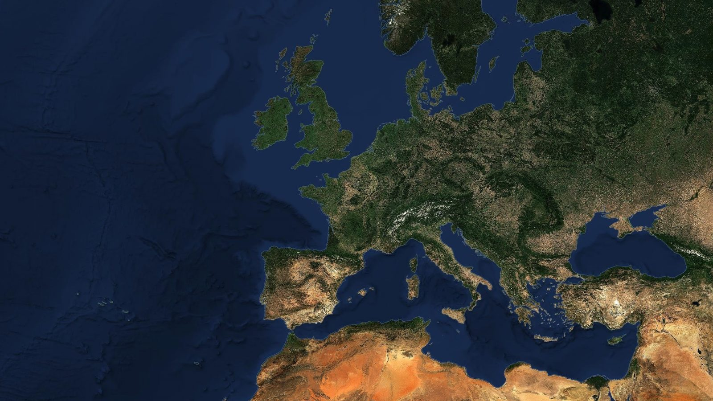
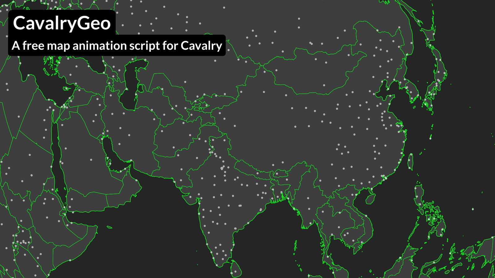
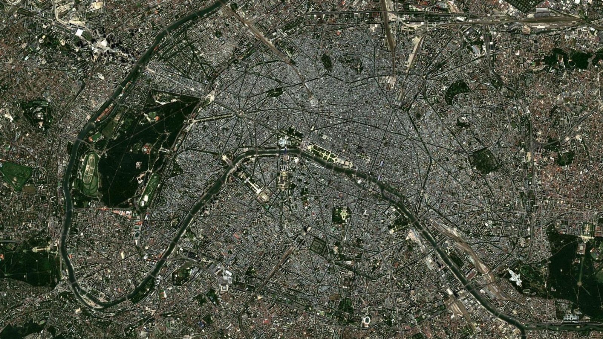
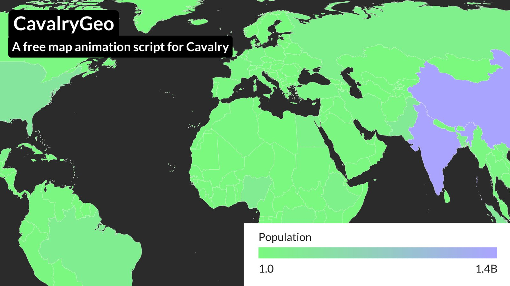

# Cavalry Geo

**Animated maps inside [Cavalry](https://cavalry.studio/)** — world and street maps, satellite
imagery, flight routes and data maps that all move with one camera.

### [⬇ Download the latest version](https://github.com/optative-visuals/CavalryGeo/releases/latest)

Free and open source. Search a place, and Cavalry Geo builds the map for you as ordinary Cavalry
layers you can style, keyframe and render.

## What it does

### World and street maps
Countries, coastlines, rivers and cities from Natural Earth, or buildings, roads, water and parks
from OpenStreetMap — on a flat map, a spinning globe, or zoomed into a street.

### Satellite imagery and camera flights
Put real satellite imagery under your map that stays sharp as the camera zooms. **Fly here**
animates a smooth zoom‑out, travel and zoom‑in between places, from the whole world down to a
city.

### Routes
Flight arcs and multi‑stop journeys that draw on, lift off the map and wrap round a globe.

### Data maps
Paste a Google Sheet or CSV link and get coloured countries, bubbles, value labels and a legend —
then animate them through the years.

### And more
Pins and labels for places, **Extract** to pull one country or street into its own layer, and
**Bake** to turn any map layer into a plain editable shape.

## Install

1. Download the latest **CavalryGeo** zip from the
   [Releases page](https://github.com/optative-visuals/CavalryGeo/releases/latest) and unzip it.
2. In Cavalry, choose **Help → Show Scripts Folder**, and drag **CavalryGeo.js** and the
   **CavalryGeo_assets** folder straight into it.
3. Open **Scripts → CavalryGeo**. No restart needed.

To update, drag in the files from a newer release and replace the old ones.
Tested with Cavalry on Windows; macOS hasn't been tried yet.

## Quick start

1. Open the panel in a new scene. On **Map**, type a place — say `Paris` — and press **Search**.
   That makes a map centred on Paris.
2. On **Layers**, tick **Countries** and **Coastlines** and press **Add layers**.
3. With the playhead at the start, pick **World view** in the place list on **Map** and press
   **Jump here**, then pick Paris again and press **Fly here**. The camera now flies from the
   world into Paris.
4. On **Imagery**, press **Build imagery** and say **Yes**. Play it back.

Everything else — routes, data maps, pins, streets, extract and bake — is in the
**[full guide](docs/guide.md)**.

## Credits

- **Natural Earth** world data is public domain and bundled with the plugin.
- **OpenStreetMap** street data is downloaded on demand and licensed
  [ODbL](https://www.openstreetmap.org/copyright) — keep the "© OpenStreetMap contributors" credit
  layer in scenes that use it.
- **Imagery:** EOxCloudless by EOX IT Services GmbH (contains modified Copernicus Sentinel data;
  non‑commercial use), NASA Blue Marble (public domain), or MapTiler / Mapbox with your own key.
  Check each provider's licence for your use.

See the guide for [known limits](docs/guide.md#known-limits). Working on the code? See
[docs/development.md](docs/development.md).

## Licence

Cavalry Geo is free software: you can redistribute it and/or modify it under the terms of the GNU
General Public License as published by the Free Software Foundation, either version 3 of the
License, or (at your option) any later version ([GPL-3.0-or-later](LICENSE)). It is distributed in
the hope that it will be useful, but WITHOUT ANY WARRANTY; without even the implied warranty of
MERCHANTABILITY or FITNESS FOR A PARTICULAR PURPOSE.

Versions up to and including v0.1.1 were released under the MIT licence; copies obtained under
those releases keep that licence. Map data keeps its own licences (see *Credits*).

## Showcase

https://github.com/user-attachments/assets/ffaa83a8-6369-469b-842e-84a03730da85

https://github.com/user-attachments/assets/33f2a233-cc6f-4e07-bd8f-aa871e37780c

